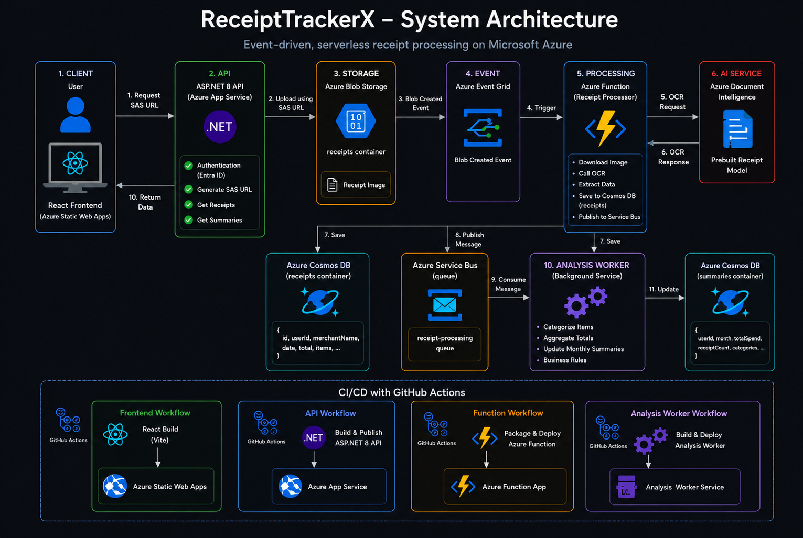
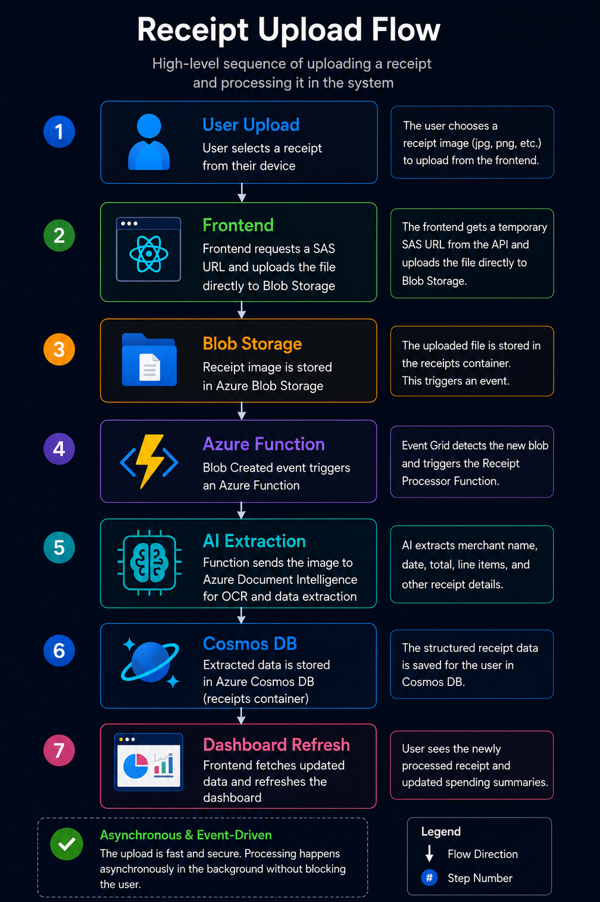
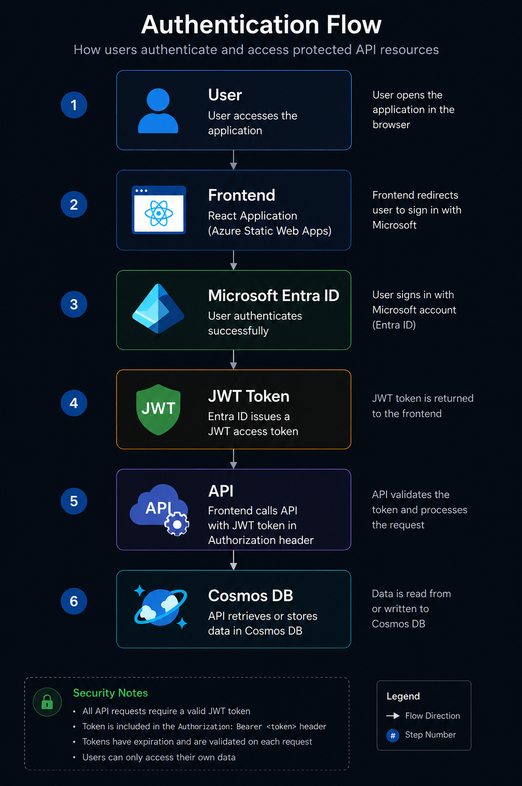

# ReceiptTrackerX

ReceiptTrackerX is a cloud-native expense tracking application that automatically extracts data from receipt images and generates spending summaries using Azure services.

Users upload receipts through a web application, and the platform processes them asynchronously using Azure Functions, Azure Document Intelligence, Cosmos DB, and Azure Service Bus.

---

## System Architecture



End-to-end, event-driven, serverless receipt processing on Microsoft Azure. The React frontend uploads receipts directly to Blob Storage using a short-lived SAS URL issued by the API. Event Grid triggers an Azure Function that runs OCR via Document Intelligence, persists structured receipt data to Cosmos DB, and publishes a message to Service Bus. A background Analysis Worker consumes those messages to build monthly spending summaries.

---

## Live Application

**Frontend:** https://wonderful-meadow-0dd696d0f.7.azurestaticapps.net

**API:** https://receipttrackerx-api.azurewebsites.net

---

# Azure Services Used

## Azure Static Web Apps

Hosts the React frontend.

## Azure App Service

Hosts the ASP.NET 8 Minimal API.

## Azure Blob Storage

Stores uploaded receipt images.

## Azure Event Grid

Triggers processing whenever a new receipt is uploaded.

## Azure Functions

Processes uploaded receipts.

Responsibilities:

* Download uploaded receipt
* Call Document Intelligence
* Extract receipt data
* Store receipt in Cosmos DB
* Publish processing event to Service Bus

## Azure Document Intelligence

Uses the prebuilt receipt model to extract:

* Merchant name
* Transaction date
* Total amount
* Line items

## Azure Cosmos DB

Stores:

### receipts container

Processed receipt data.

### summaries container

Aggregated monthly spending summaries.

## Azure Service Bus

Decouples receipt ingestion from analysis.

Used to send receipt processing events to the analysis worker.

## Analysis Worker

Consumes Service Bus messages and updates spending summaries.

## Microsoft Entra ID

Handles user authentication and authorization.

Frontend uses MSAL to authenticate users and obtain API access tokens.

---

# Receipt Upload Flow

The diagram below shows the high-level sequence of uploading a receipt and processing it asynchronously across the platform.

<p align="center">
  
</p>

1. The user selects a receipt image from their device.
2. The frontend requests a short-lived SAS URL from the API and uploads the file directly to Blob Storage.
3. Blob Storage persists the file in the `receipts` container and emits a `BlobCreated` event.
4. Event Grid triggers the Receipt Processor Azure Function.
5. The function calls Azure Document Intelligence to OCR and extract receipt fields.
6. Extracted data is stored in Cosmos DB (`receipts` container) and a message is published to Service Bus.
7. The dashboard refreshes and the user sees the processed receipt with updated spending summaries.

---

# Authentication Flow

Users sign in with their Microsoft account through Microsoft Entra ID. The frontend uses MSAL to obtain a JWT access token, which is sent on every API call so the backend can authorize requests and scope data to the signed-in user.

<p align="center">
  
</p>

1. The user opens the application in the browser.
2. The frontend redirects the user to sign in with Microsoft.
3. Microsoft Entra ID authenticates the user.
4. A JWT access token is issued back to the frontend.
5. The frontend calls the API with the token in the `Authorization: Bearer <token>` header.
6. The API validates the token, then reads from or writes to Cosmos DB on the user's behalf.

All API requests require a valid JWT token, tokens are validated on every request, and users can only access their own data.

---

# CI/CD

GitHub Actions are used for automated deployments.

## Frontend Deployment

Trigger:

```text
Push to main
```

Workflow:

1. Build React application
2. Deploy to Azure Static Web Apps
3. Publish updated frontend

## API Deployment

Trigger:

```text
Push to main
```

Workflow:

1. Restore .NET dependencies
2. Build ASP.NET API
3. Publish application
4. Deploy to Azure App Service

## Function Deployment

Trigger:

```text
Push to main
```

Workflow:

1. Package Azure Function
2. Deploy to Azure Function App

---

# Running Locally

## Prerequisites

* Node.js 20+
* .NET 8 SDK
* Azure Functions Core Tools
* Azure account
* Git

---

## Frontend

```bash
cd frontend

npm install

npm run dev
```

Runs on:

```text
http://localhost:5173
```

---

## API

```bash
cd api

dotnet restore

dotnet run
```

Runs on:

```text
http://localhost:5279
```

---

## Azure Function

```bash
cd receipt_processor

func start
```

---

# Project Structure

```text
ReceiptTrackerX
│
├── frontend/
│   ├── src/
│   └── public/
│
├── api/
│   ├── Endpoints/
│   ├── Models/
│   ├── Services/
│   └── Program.cs
│
├── receipt_processor/
│   └── Azure Function
│
├── analysis_worker/
│   └── Service Bus Consumer
│
├── docs/
│   └── diagrams/
│
└── .github/
    └── workflows/
```

---

# Key Features

* Microsoft authentication
* Direct Blob uploads using SAS URLs
* Event-driven architecture
* Automatic OCR receipt extraction
* Cosmos DB persistence
* Monthly spending summaries
* Asynchronous processing with Service Bus
* Azure-hosted production deployment
* Automated CI/CD with GitHub Actions

---

# Future Improvements

* Receipt categorization
* Spending analytics charts
* Budget tracking
* AI-powered spending insights
* Receipt search and filtering
* Export to CSV/PDF

---

# Tech Stack

Frontend

* React
* TypeScript
* Vite
* MSAL

Backend

* ASP.NET 8 Minimal APIs
* Azure SDKs

Cloud

* Azure Blob Storage
* Azure Functions
* Azure Document Intelligence
* Azure Cosmos DB
* Azure Service Bus
* Azure App Service
* Azure Static Web Apps

DevOps

* GitHub Actions
* GitHub
